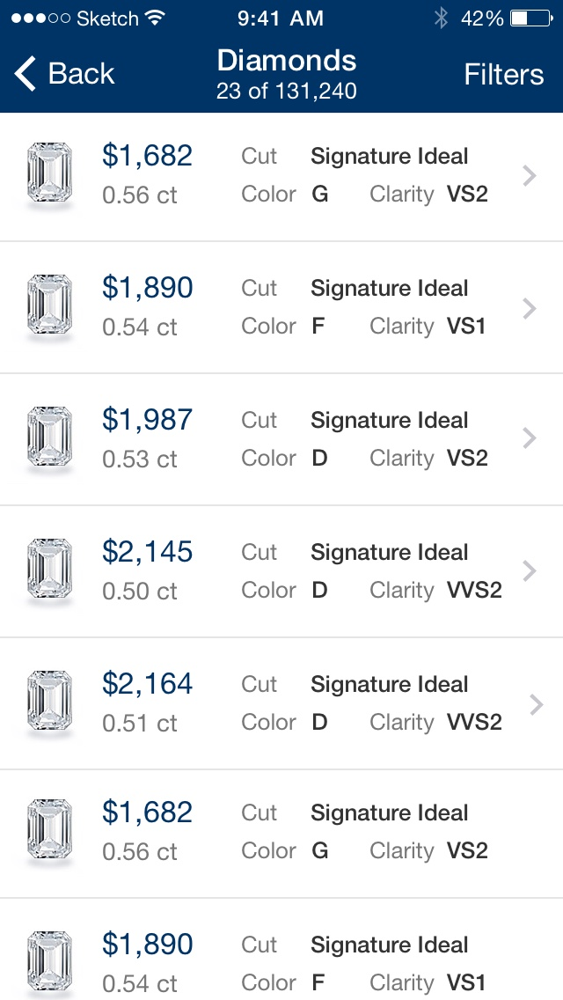

# Blue Nile
**Blue Nile**'s iPhone app hadn't seen a major update in a few years, and it needed a more modern look for the new aesthetic of iOS 7 and the larger screen size of the new iPhone.

I worked with Toy Rockets to refresh and redesign Blue Nile's existing app, and also added a new 'Try it On' feature so shoppers could see how a ring might look on their own hand.

{:.gallery-phone}

## Custom Engagement Rings
### Build Your Own Ring
The Ring Builder guides shoppers through the steps of designing their own ring, letting them build a totally custom piece from the thousands of available stones and settings.

## Random Rings
### Dream Box
The most popular feature in Blue Nile's previous app was the Dream Box, which would choose randomly from a list of recently purchased rings. We kept the Dream Box and Build Your own Ring sections separate so shoppers could keep the ring they had built for themselves, and could also get some ideas & inspiration from the app.

{:.gallery-phone}

{:.gallery-phone}

## *Sort of* Augmented Reality
### Try it On
After building their ring, shoppers can take a photo of their (or a partner's) hand and get a to-scale preview of how it will look on their own finger. This personalized photo and ring placement persists, and shows up as a product photo on any ring throughout the app.

Here is an [enthusiastic write up on Glamour ↗](http://www.glamour.com/weddings/blogs/save-the-date/2014/10/blue-nile-engagement-rings) about the try it on feature.