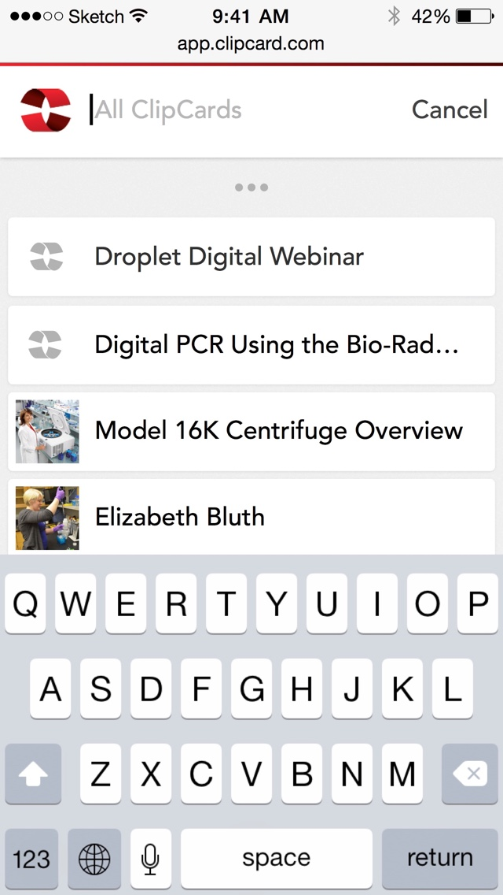
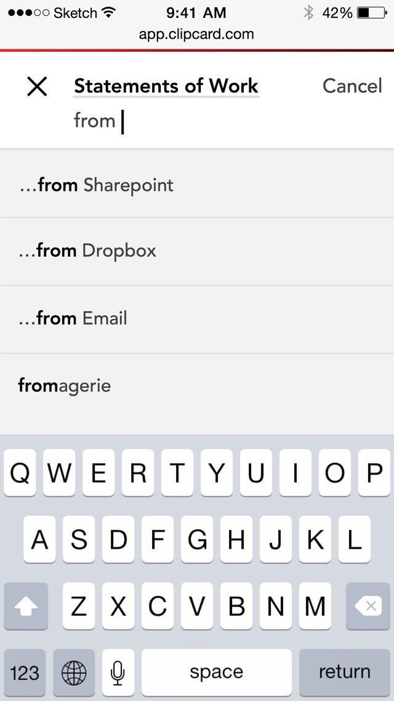
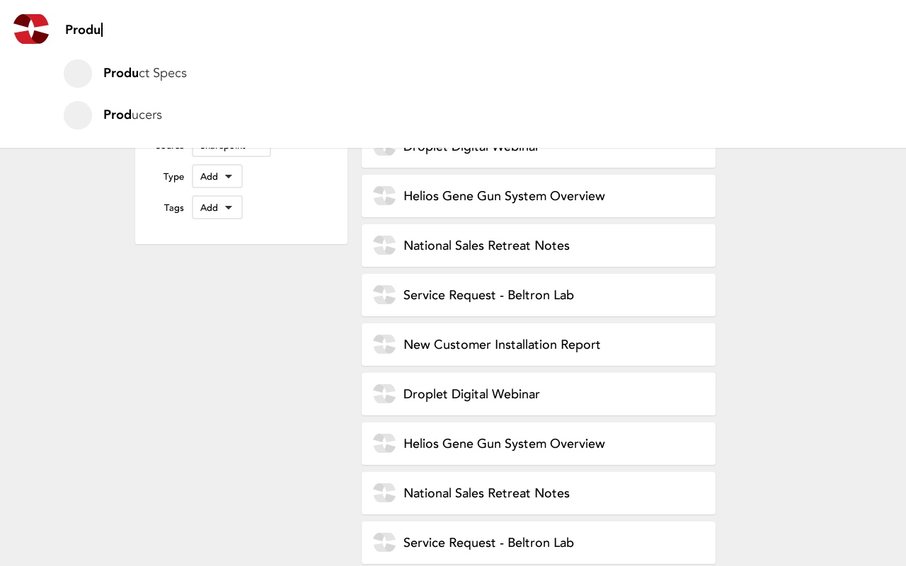
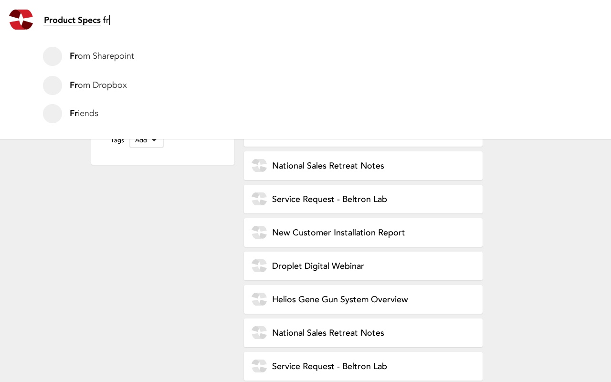
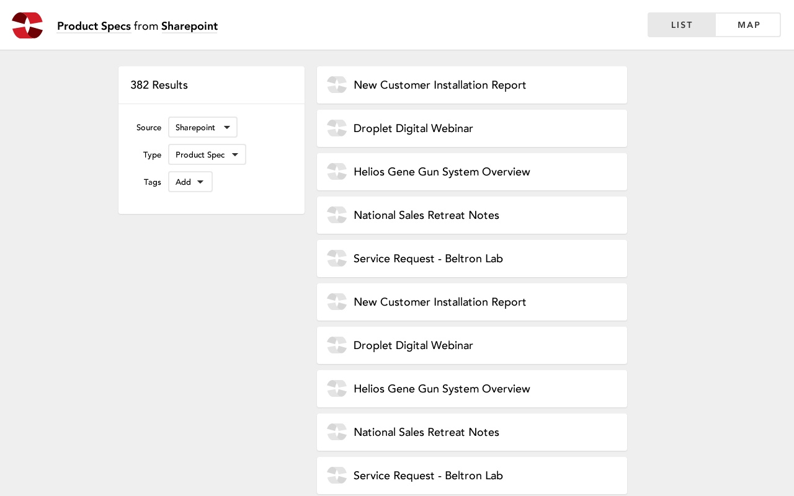
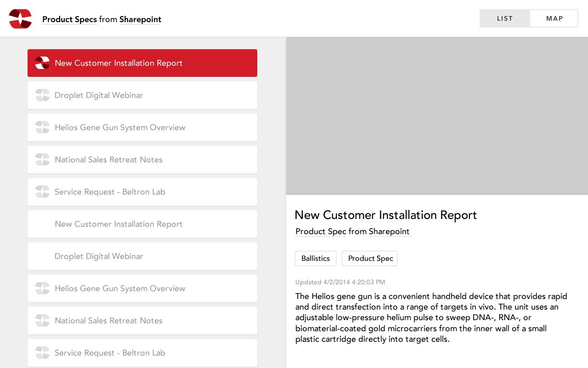

# ClipCard
**ClipCard** was making it easier to find your cloud files. By combining services like Dropbox and Google Drive (and many more) into one searchable UI, you could search all your cloud-based stuff at once, and actually find the thing you were looking for.
I worked with the ClipCard team to help clarify their search UX.

## Responsive Web App
ClipCard is built around the metadata from your files, so the search needed to be flexible and powerful, while retaining a sense of clarity. The goal was to surface the complexity only when needed, and otherwise keep it hidden.

## Responsive Web App
### Scaling Up
ClipCard was being developed mobile-first, but it would also need to work on larger screens. I also helped with some Wireframes for larger sizes.

