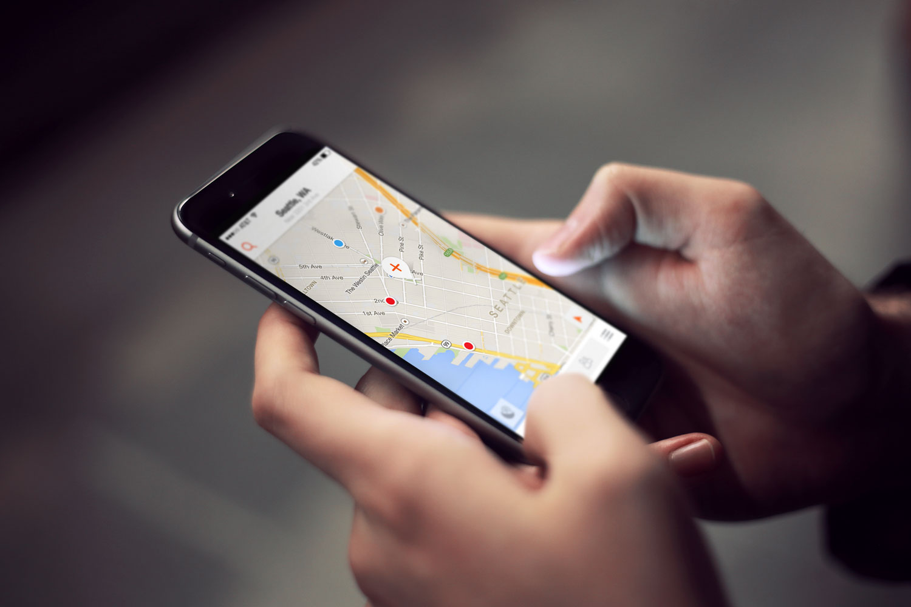
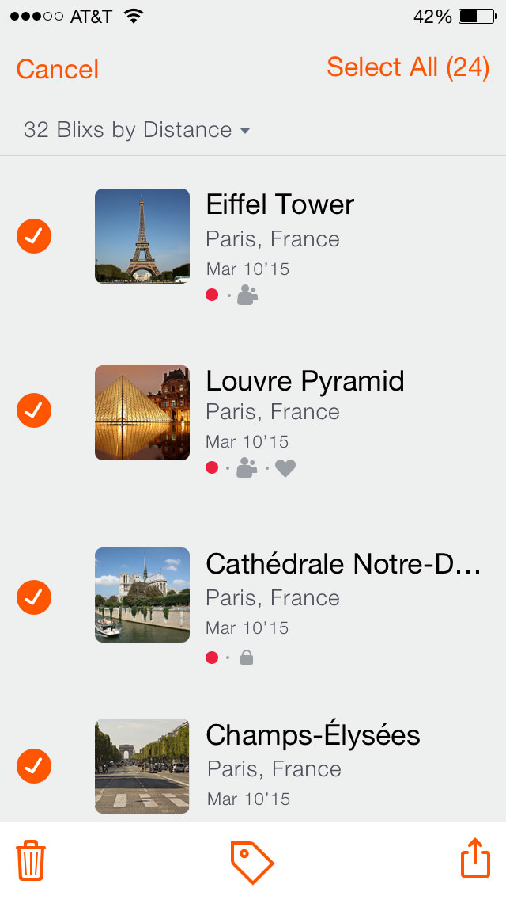
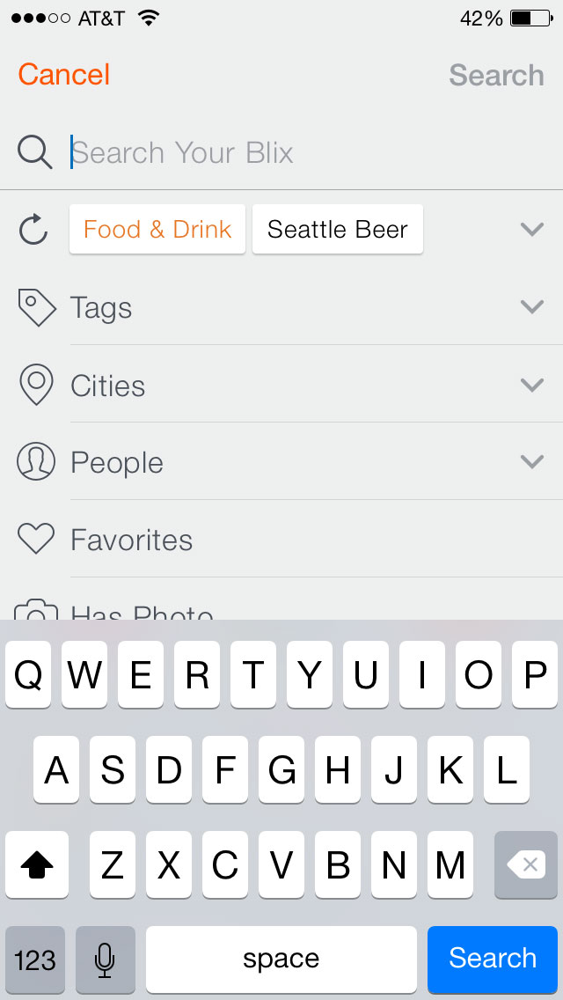
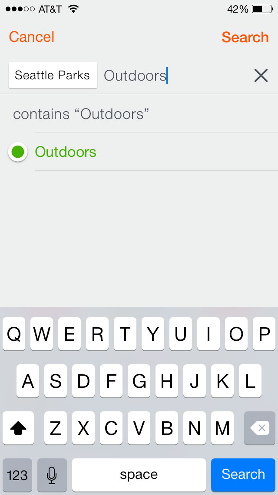
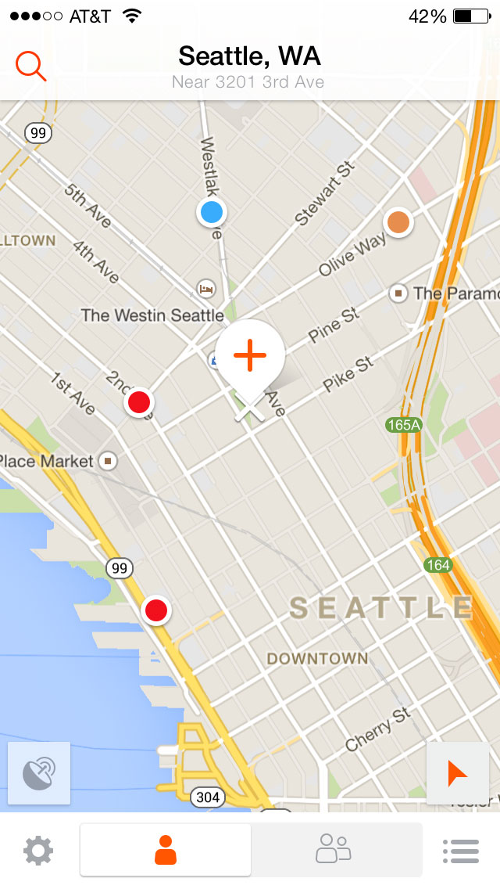
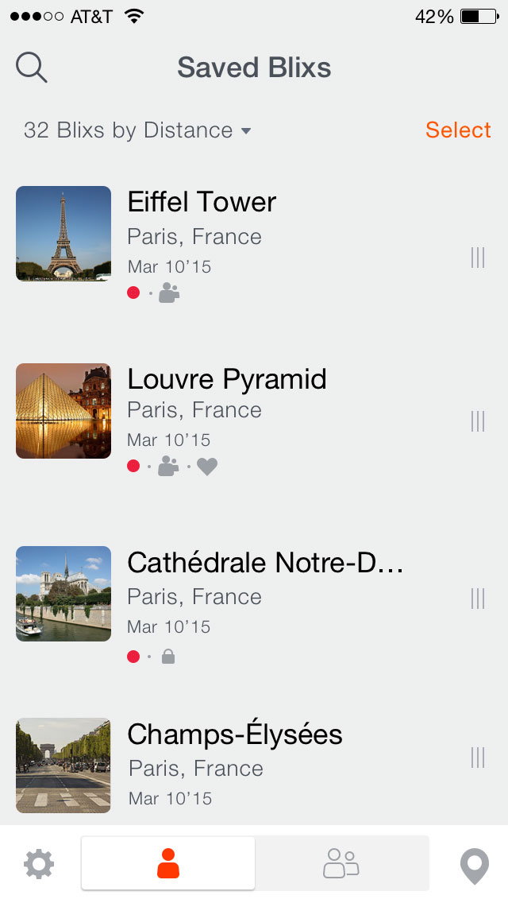
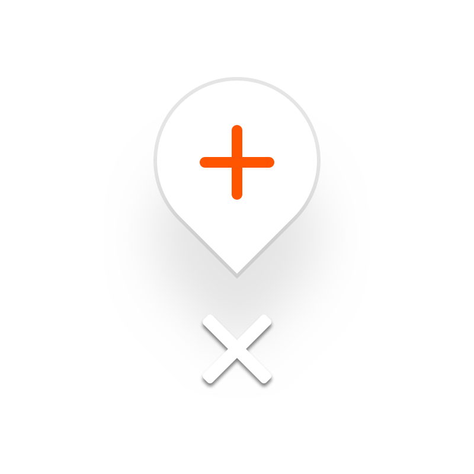
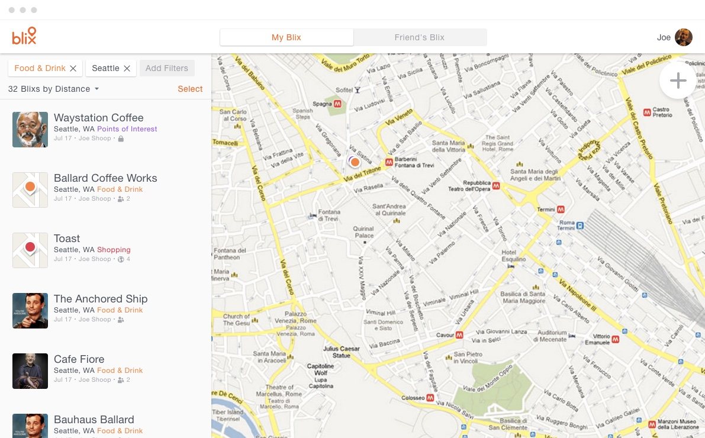
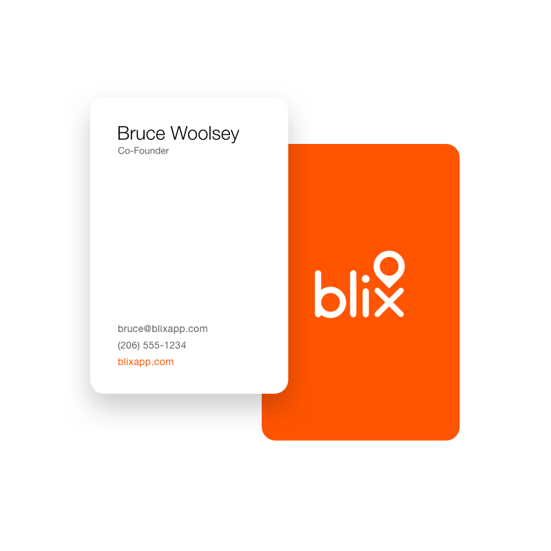

# Designing an iPhone app to keep track of your favorite places with **Blix**





{:.w-full}

**Blix** is an iPhone App to help you keep track of places you've been, places you want to go, and places you don't want just anybody to know about.

I worked with the founders to design an iPhone App and associated collateral, including some branding, a landing page website, and several prototypes for a future desktop version of the app.

## iPhone App
Keep track of where you want to go for your next trip, share a collection of places with everybody, or a private list with just a few close friends.

{:.gallery-phone}
* 
* 
* 
* 
* 
* 

#### Update - 2018
Last spring, when the weather was finally getting nice again, my girlfriend and I spent a rare warm and sunny spring Saturday hanging out at Seattle's Greenlake with some friends. There is this great grassy spot on the north side of the lake with an ideal combination of both sun and shade, almost no road noise, and plenty of nearby parking.

I wanted to make a note of this spot for the next time we go, but there is no address here – its just a grassy area in a park. This would have been the ideal use for Blix, which is unfortunately no longer available on the App Store.

Since working on this project 3 years ago, Google Maps has improved their saved places feature, which I find myself using as a replacement. However, saved places in Google Maps is missing a lot of the basic things we had in the Blix app – like being able to name a place you've saved. I have this lakeside patch of grass saved in Google Maps, but like the handful of other places I've saved, it is named simply "Dropped Pin", whithout the ability to rename it, or add photos or notes to it.

## A Prototype is worth a hundred thousand words.

On the map view, we included an 'Add new Blix' button in the center of the screen that would animate a bit when you moved the map around. To help communicate how the animation worked to the developers, I build a few html/css prototypes.
[See it on Codepen ↗](http://codepen.io/anon/pen/Kwwddb)
[See it on Codepen part 2 ↗](http://codepen.io/anon/pen/zGCDn)

<section class="dark" markdown="1">
While the initial design work for the iPhone app was wrapping up, we started thinking about how Blix might later scale up to bigger screens, and I built an html prototype to help visualize this exploration.

[See the Prototype ↗](/projects/blix/blix2/ "Opens in a new Tab")

{:.gallery-desktop}
* 

</section>

<section class="branded" markdown="1">

</section>

{:.w-full}
