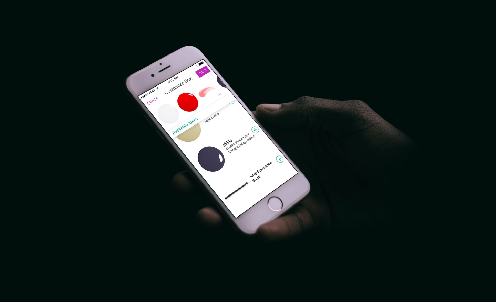
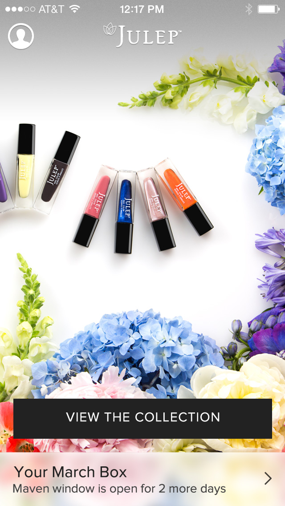
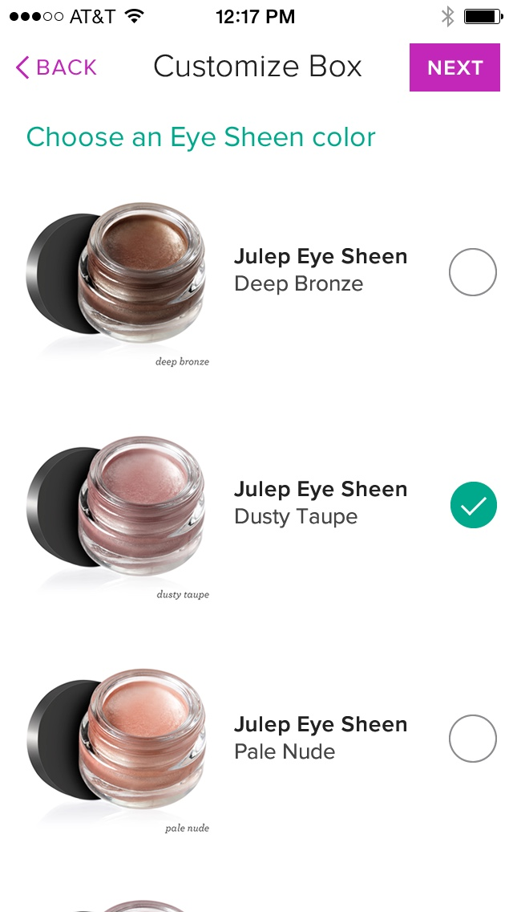
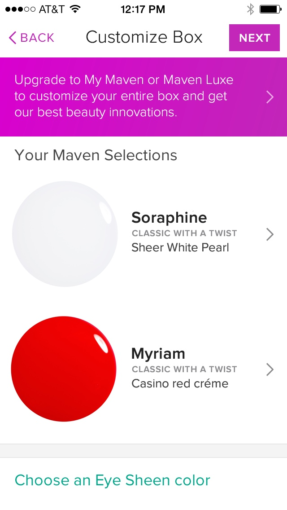
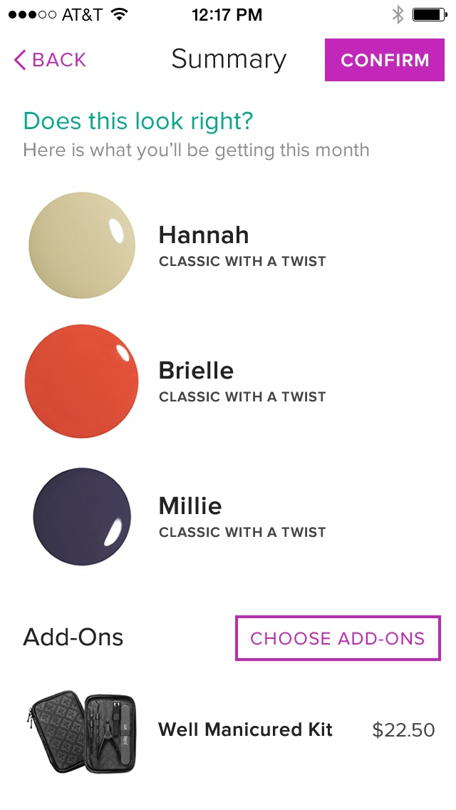
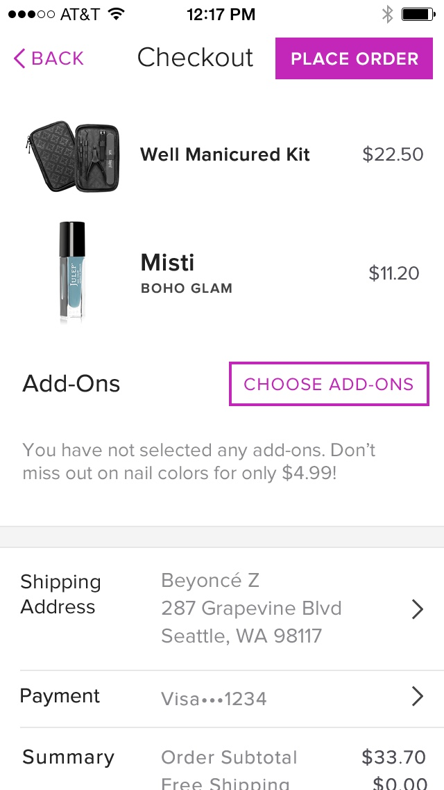

# A new app for a new subscription box from **Julep**





{:.w-full}

Julep was expanding their Maven subscription with new tiers, letting subscribers customize which beauty items they wanted in their upcoming box.
I worked with [Toy Rockets ↗](http://toyrockets.com/) to design a new iPhone App for Julep that included this upgraded flexibility and helped clarify how to take advantage of these new features.

## Version One
### Minimum Viable Product
At first, the app was exclusive to existing Maven subscribers. Customers could see what was included in that month's box, pick a different style if they preferred, and sometimes choose a color for an item.

## V2
### Customizing Your Box
Later, after the changes and upgrades to the Maven subscription were introduced, the app would be updated to include a flow that would allow subscribers to customize their entire box.

## V3
### A Complete Shopping Experience
Finally, all products available on the website would become browseable, searchable, and available for purchase in the app. The app would see another udate to include a cart and a full checkout flow.

