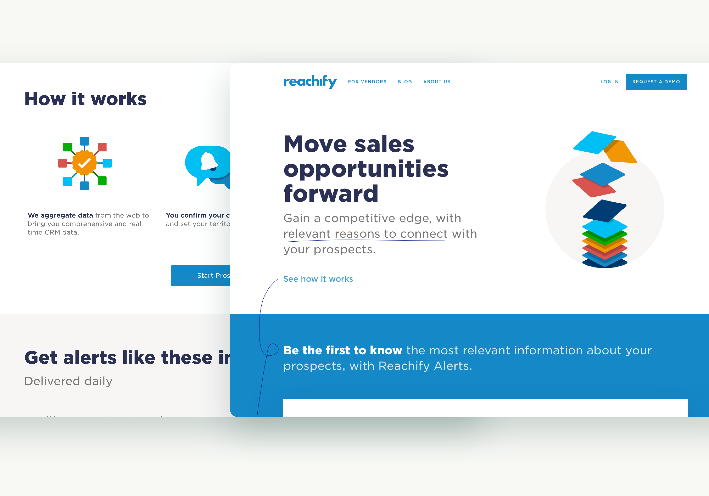
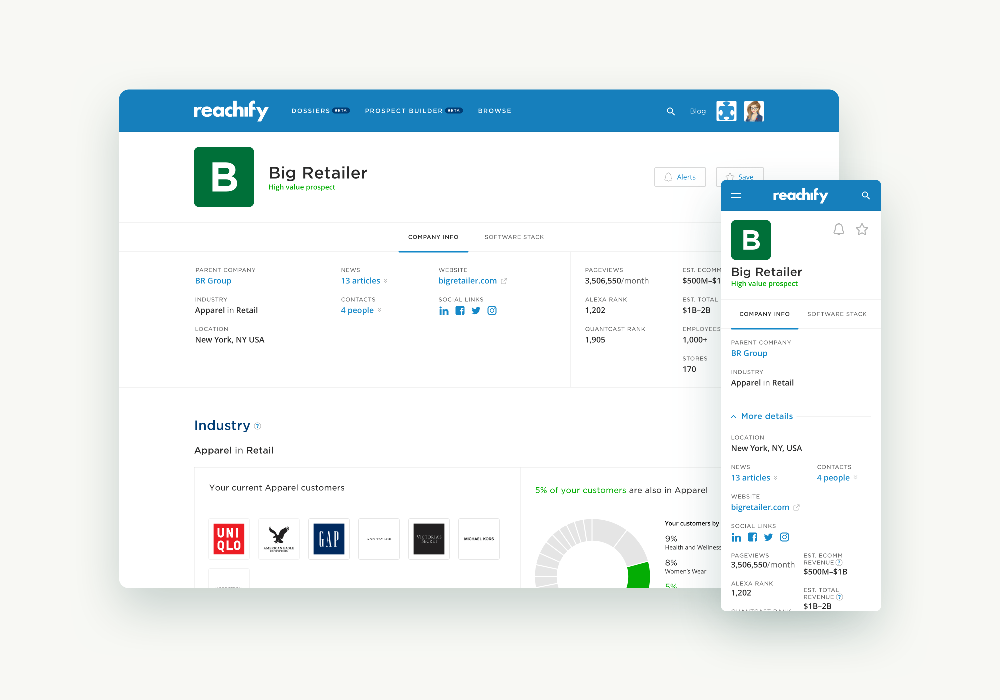
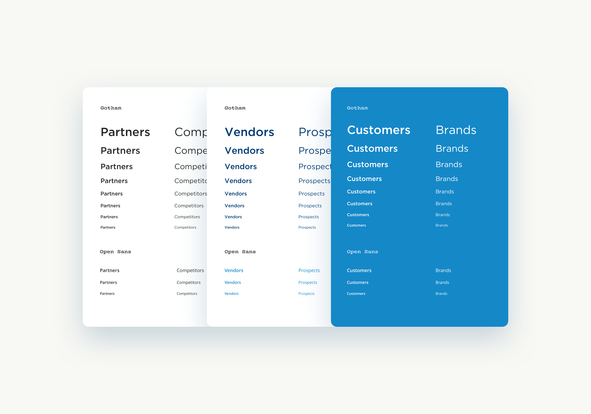
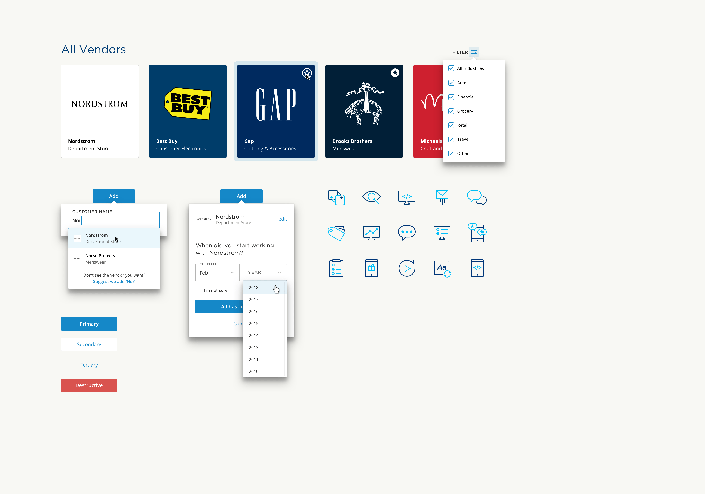

# A design system and custom website for **Reachify**





{:.w-full}

Reachify was building a product to help retail executives make sense of which vendors their companies should be working with. They had a bunch of data about the vast network of business relationships between brands and vendors, and they needed some help making all that data understandable and accessible.

We worked with Reachify to help define some basic brand guidelines, design a marketing site, and to design the interface for the various tools in the webapp.

{:.w-full}

Behind the scenes, there were two separate versions of the Reachify web app, depending on if a user was signed in as a Vendor or a Brand. 

Reachify would help Vendors find out which Brands might be in need of their services, based on industry experience, geographical location, software compatability and more. 

A Brand account could find a personalized list of recommended Vendors for any given category.

{:.w-full}

Actually, a vendor could set up filters to see which industry a brand was in, or total revenue and company size, or 

{:.w-full}

Reachify had compiled all kinds of data about which
The Ask
The Brief
At the beginning...
The Idea

What we did
How we made it different

{:.w-full}

## Design System / Component Library
To maintain consitency and avoid duplicating work, I focused on building a series of components and text styles that would all work together blah blah

### ShortList
Description of shorlist

### List Builder
Description of List builder

{:.w-full}

### Company Profiles
Description of company profiles

### Other major sections
Description of other major sections

### Rebrand
Description of rebrand

## Making connections
Reachify was building a web-based product to help guide companies making decisions about what software and services they used to build their websites. Reachify had been cataloging all kinds of info about how websites were built, from which CMS they were using, to their domain registrar, analytics software, AB testing tools, and about 100 other categories. 

We helped Reachify make sense of all that info, and designed not only an easy way to ‘look under the hood’ on a specific website, but also a tool for customized recommendations based on what was common in a customer’s industry, what their competitors were using, and compatibility with their existing software.

{:.w-full}
