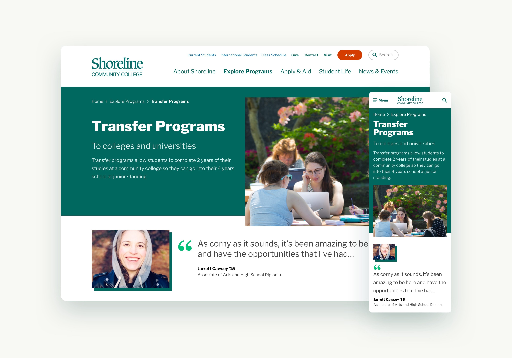
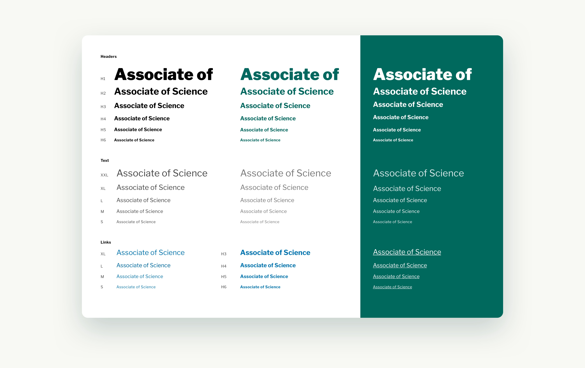
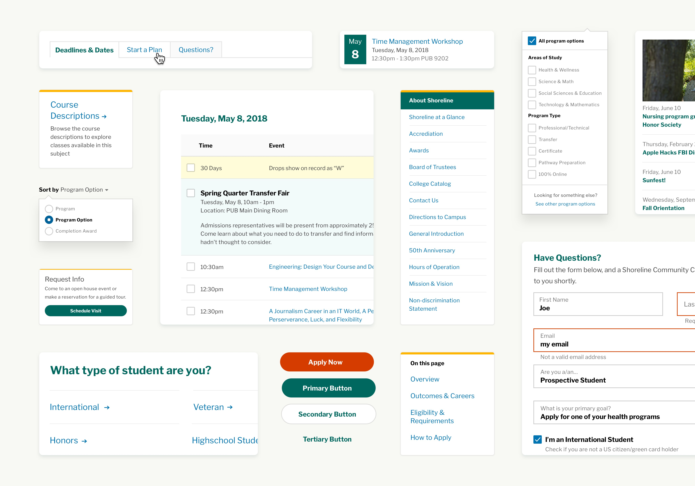
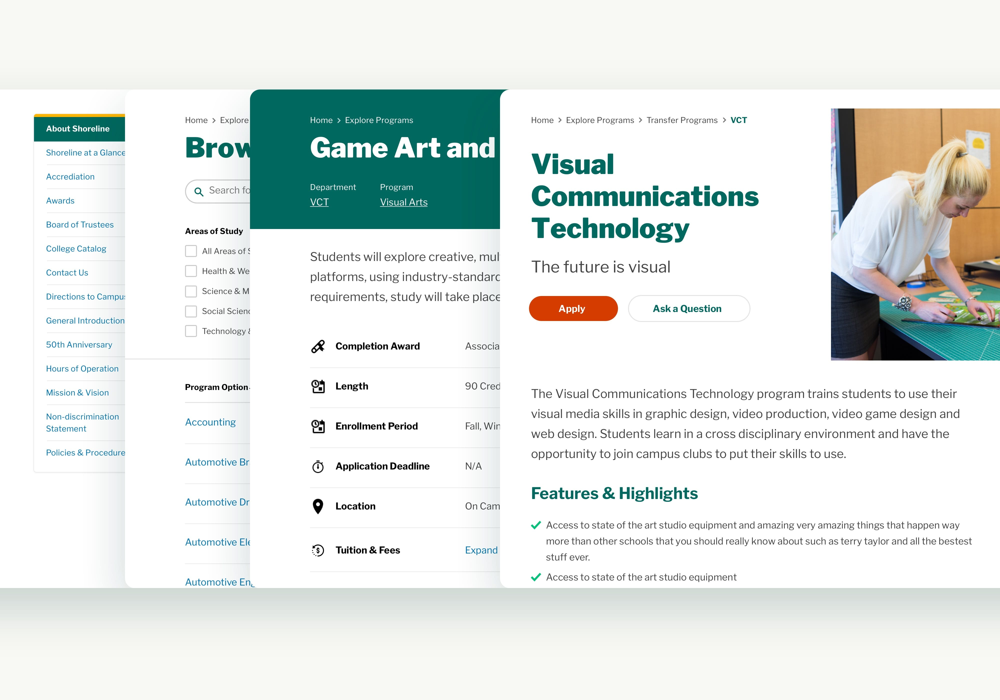

# {{ page.tagline }}


    

        
    

    

        
The Project

        <h2><strong>Reachify</strong> was building a web app that would position them as a matchmaker between online retailers and vendors.</h2>
    

    

        
They had collected a bunch of data about all kinds of connections between retail businesses and the software vendors those businesses used to manage and maintain their online presense.

        
Working with a small team, I helped refine Reachify’s brand, designed and maintained a system of components, and impelemented designs using those components for a series of products.

    

    

        
        This is a caption for the above photo
    

    

        
    

    

        
        This is a caption for the above photo that is very long and will eventually wrap to a second or third line if I keep typing
    

    

        
    

    

        
        This is a caption for the above photo that is very long and will eventually wrap to a second or third line if I keep typing
    

    

        
        This is a caption for the above photo that is very long and will eventually wrap to a second or third line if I keep typing
    

    

        
    

Having recently received a rebrand with a styleguide specific to their printed materials, **Shoreline Community College** needed some help translate these guidelines for use on their website.

Studio Upleft worked with Shoreline to expand their brand into a functional system of web-friendly type styles and atomic components that would all work together to form a variety of page types.

The Shoreline Design System is built on a foundation of simple, readable, and consistent typography. Early on, it was clear that _Inclusion_ and _Accessibility_ were central to Shoreline's mission and purpose, so it was very important that those values were visible in all parts of the design.

The typography consists of a single typeface, with 6 contrasting sizes, 2 weights, and a limited set of high contrast colors that meet or exceed WGAC AA contrast guidelines ([↗](https://www.w3.org/WAI/WCAG21/quickref/#contrast-minimum)).

Building upon the type system, we kept Atomic Design principles in mind while working toward a cohesive set of components. These components were constantly evolving and being tweaked throughout the process – making sure each individual piece had it's purpose and was working in balance with the larger system.

While consistency was an important goal, there was a lot of variation in the type of information that could appear on a page, depending on where it was in the hierarchy. Higher level pages often have photos, testimonials, shorter chunks of copy, and more links. As you get into the content heavy pages, the copy is often longer, images are uncommon, and there are sometimes tables or accordions.

Combining the compontents and type sizes in slightly different ways gives us the flexibility to change the design of an individual page to fit it's content, so that a top level page looks quite different from a deep content page. Maintaining this kind of 'cohesive looseness' ensures that the system has room to grow, and that it will continue to work in the future and adapt to new pages and content types.

> Quote from Adam about how great it was working with me