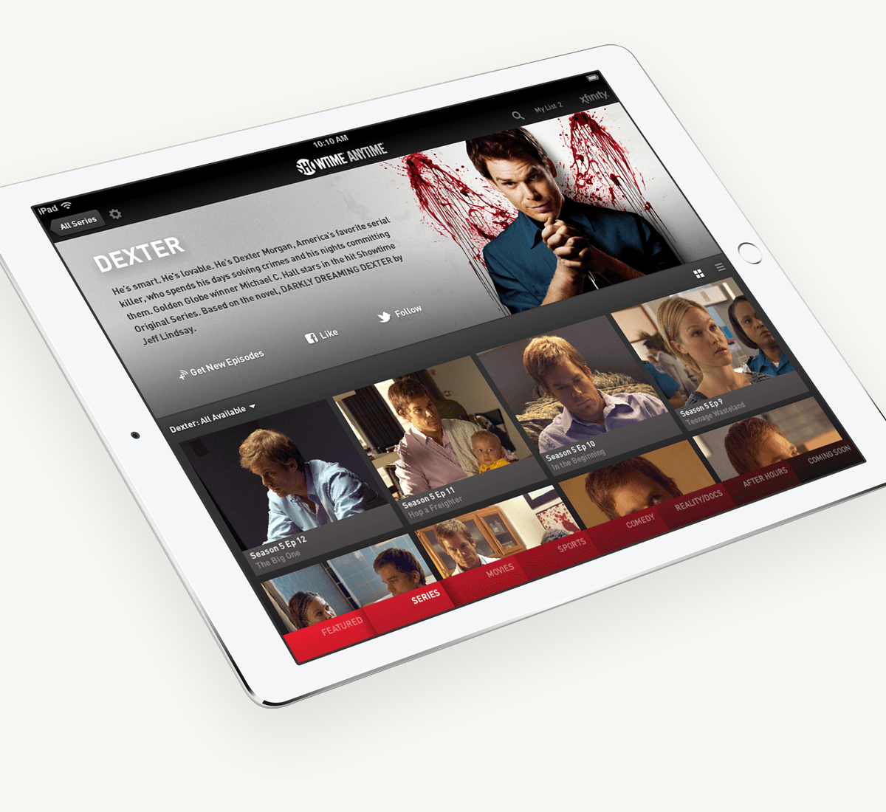
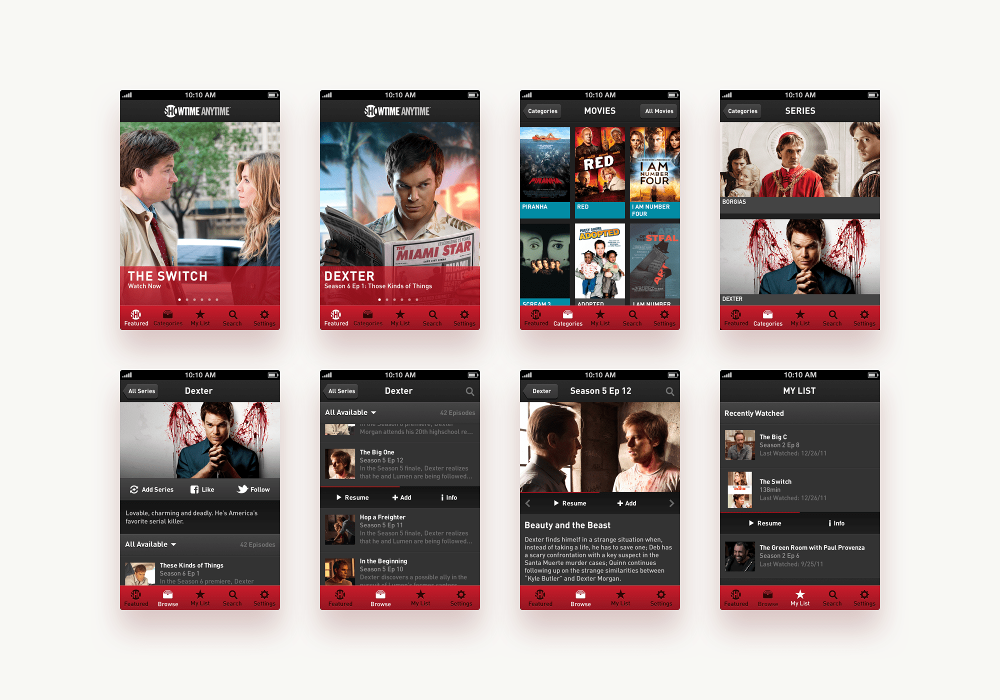
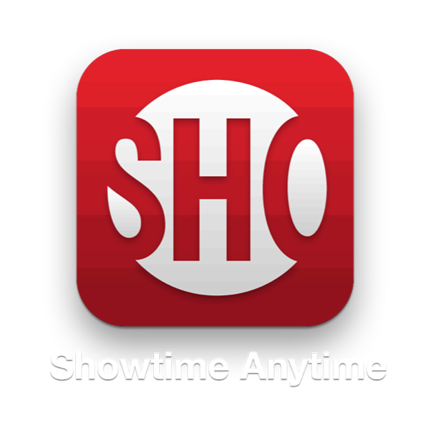

# Designing an iPhone and iPad app for **Showtime**





**Showtime** was working on a new on-demand streaming video service for all of their content called Showtime Anytime. In late 2011, they came to Übermind, where I was working as a designer, to build an iPad & iPhone App for this new service.

I led the visual design for this effort.

{:.w-full}

We started with the **iPad app**, since the larger screen would deliver a better experience for streaming video, and it was a more natural transition from the web version that was already in development.

There were write-ups on [Venture Beat](http://venturebeat.com/2012/01/10/showtime-ipad-app/) and [Tech Crunch](http://techcrunch.com/2012/01/10/new-showtime-anytime-app-brings-showtimes-movies-and-shows-to-the-ipad/) about the launch of the ipad app.

{:.w-full}

After the iPad App launched, the team began work on an **iPhone app**. Both iOS apps had the same features and aesthetic, but the navigation had to change a bit to accomidate the smaller screen on the phone. For this, we designed a custom tab bar.

{:.w-full}

