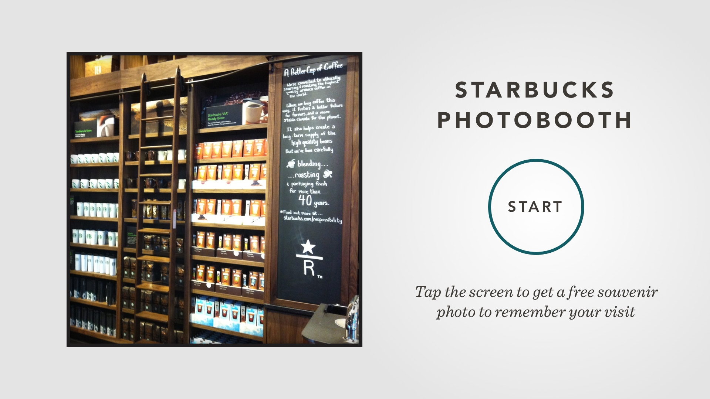

# Various projects for **Starbucks**





**Starbucks** wanted to update the Touch-Screen Photo Booth in their Times Square flagship store with a custom-built solution that made it really quick & easy for visitors to take a souvenir selfie while they were waiting for their coffee.

I worked directly with Starbucks to design the UX and simple UI for this new photobooth.

I've been told that customer interaction with the updated photobooth has been 400% higher than the previous version.

## Say Cheese!
### Touchscreen Photobooth
The goal of this project was to provide a fun memento of a customer's visit to the Times Square Starbucks Store, and ultimately, to capture an email for the Starbucks newsletter. We aimed to reduce as much friction as possible - a photo can be sent with as few as 4 total taps (not including typing an email address with an on-screen keyboard).

## Tasting Notes
### Coffee Passport
**Starbucks** was working on a new digital version of their Coffee Passport, which allows partners and customers to keep a journal of tasting notes as they try all of the different available roasts, and unlock stamps as they go.

I helped with a few of the stamps, as well as few illustrations for an App Icon, seen below.

