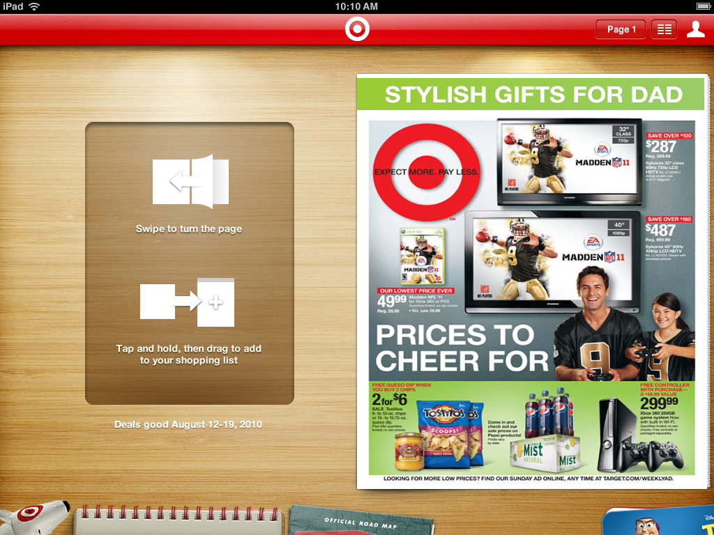

# Designing an iPhone and iPad app for **Target**





In 2010, shortly after Apple announced the original iPad, Target and Übermind worked together to launch **Target's first iPad App**, and an update to their iPhone app. While employed as a designer at Übermind, I led the visual design of these apps. 

For iPad, the plan was to recreate Target's Weekly Ad in the form of an app, complete with animated page turning, a coffee table metaphor, and all the skeuomorphic design that goes along with that.

### Working with Restrictions
At the time, Target was working on a major overhaul of the APIs that were used in their apps for the full store inventory, but they wouldn't be ready for almost a year.

What we did have available was an API for the contents of the *Weekly Ad* and the *Store Finder*. Because of these technical limitations, the primary goal of the iPad app became brand exposure, and to get people to go to their nearest Target store. We wanted to create a rich-feeling app experience even though the app would not include many of the features consumers had come to expect from their apps.

### Adding Browsing & Searching
Later, as some parts of the APIs started to become available, we were able to add *Product Browsing* and *Searching* to the app. The app was due for a full redesign to account for these new features, but in the meantime, we wanted to get them into the existing app as quickly as we could.

### Lessons Learned on Designing for Screens
People much more eloquent than I have written at great length about the issues with skeuomorphic design, many of which I experienced first-hand working on this project. It is fun to look back and remember how much time was spent trying to stick with the visual metaphors we had chosen. Textures had to look realistic, shadows and highlights had to be properly aligned to an imagined off-screen light source, and the objects on screen had to adhere to the physical properties of their real-world analogues. Things couldn't pop into existence, or scale up or down, or fade away, because that is not how real world objects behave. They had to slide around in 2D space, and they couldn't overlap in 'incorrect' ways as they did. All for the sake of 'realism'.

I remember many conversations about how certain things should work - not because of any UX best practice, but because of the self-imposed limitations of maintaing the skeomorphic metaphor.

In the end, I found that depth, shadow, and texture can still help a great deal in directing attention or implying hierarchy, but they are tools rather than a foundation, and they should be used only with purpose and reason.

### A new Target App for iPhone, too
We also worked with Target to update and redesign their *iPhone app*, which included some new features like shopping lists and a store finder. We designed a custom navigation panel that would slide up from the bottom. It allowed for six sections, one more than would be possible on the standard iOS tab bar. At the time, hamburger menus were just starting to appear in other apps, but we felt that enforcing an upper limit of six was a better solution because it would help keep the app more focused, and avoid the often overwheliming IA of hamburger menus.

