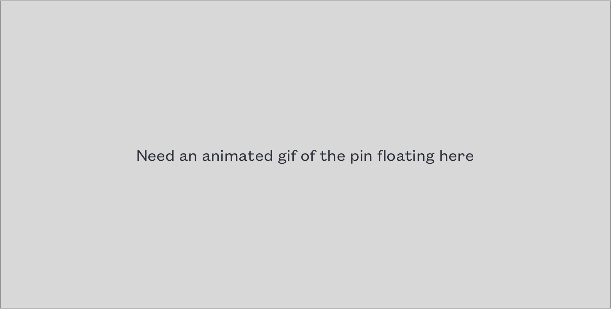

  

  

      
<h3>Overview</h3>

      

          <h2>Most mapping apps are focused on place names and addresses. Often, the location on the map is an entrance, an arbitrary geographical center, or just isn’t the interesting part.</h2>
      

  

    

        
Blix is for when the place worth bookmarking isn’t just a beach, but is the precise location of the best breaks. Or when it isn’t just a park, but is an old bench up on the bluff trail with an incredible view.

        
I worked with the team to design a mobile app. Later, I designed a logo, a brochure website, and several prototypes for a future desktop version of the app.

    

  

  

  

    
<h3>New Blix</h3>

    

        <h2>Save a new location</h2>
        
Because saving locations is the central feature of the app, we put it front and center. When the map is moved around, the New Blix pin floats in the middle of the screen, marking the spot a new Blix will be created when the button is tapped.

        
        
When that big center button is tapped, a modal opens where users can name the location if they want, add some tags to help find it again later, and add some photos, notes, and set the privacy (private by default).

    

  

    
<h3>Tagging</h3>

    

        <h2>Adding and editing tags</h2>
        
While creating a new Blix or editing an existing one, users can add custom tags for easy retrieval later.  Quick add from a sorted list of existing tags, or start typing to search tags or create a new&nbsp;one.

    

  

    
<h3>Search</h3>

    

        <h2>Find it again later</h2>
        
After a user has saved some locations, they can see them all on the map, but they might want to pull up a more specific list. Breweries in Seattle, for example, or places with a patio that are good for groups.

    

  

  

    
<h3>Logo and App icon</h3>

    

        

    

    
<h3>Business Cards</h3>

    

        

    

    
<h3>Desktop Prototype</h3>

    

        <h2>Looking to larger screens</h2>
        
While the initial design work for the app was wrapping up, we started thinking about how Blix might later scale up to bigger screens, and I built an html prototype to help visualize this exploration.

        
<a href="#">See the prototype</a>

    

  

    
  

    
<h3>Website</h3>

    

        <h2>A place on the web</h2>
        
I also designed and built a basic one-page website to promote the app and direct people to the appropriate app stores.

        
<a href="#">See the Website</a>

    

    

